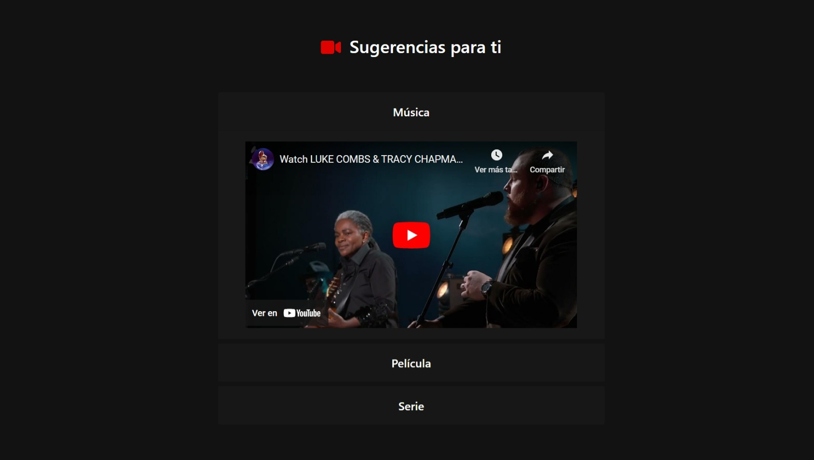

# Desafío - Sugerencia de videos

En este desafío se validarán los conocimientos de clases, polimorfismo, closures y patrón de módulo.

## Screenshots

    

## Tecnologías y herramientas usadas

- JavaScript
- HTML
- CSS
- Bootstrap

## Requerimientos

1. Implementar el Patrón Módulo mediante IIFE, donde:

● Se cree una función privada que reciba la url del video y el id de la etiqueta iframe, para así poder mostrar los videos en el documento HTML. Dato: puedes utilizar la instrucción “setAttribute” para manipular el DOM.

● Se retorne una función pública que reciba los parámetros (url, id), y realice el llamado a la función interna(privada) para insertar los elementos recibidos.

2. Establecer una clase padre denominada Multimedia para:

● Recibir la propiedad url, ejemplo:
“https://www.youtube.com/embed/5PSNL1qE6VY”,lacualseráelatributosrc
la cual sería el atributo src que necesite la etiqueta iframe para poder mostrar el video.

● Proteger el atributo de la clase implementado closures.

● Agregar un método denominado “setInicio”, que retorne el siguiente mensaje:
“Este método es para realizar un cambio en la URL del video”.

3. Crear una clase “Reproductor”, siendo hija de la clase padre Multimedia para:
www.desafiolatam.com

● Recibir la propiedad id, la cual será el elemento del DOM que se necesita para poder agregar la URL en la etiqueta iframe que corresponda. Por ejemplo: Si se envía una URL para Música, el id debe ser el perteneciente a la etiqueta iframe que se encuentra en la sección de música.

● Crear un método denominado “playMultimedia”, que permita hacer el llamado a la función pública de la IIFE, enviando los atributos url y id.

● Agregar un método denominado “setInicio”, que reciba y agregue un tiempo de inicio a la URL de la etiqueta iframe. Se puede utilizar el método “setAttribute” para modificar la URL agregando al final de la misma lo siguiente: “?start=${tiempo}”. Esto permitirá que cualquier video que
implemente el método inicie en el tiempo pasado como argumento al método al ser invocado.

4. Instanciar la clase hija pasando como argumento la URL y el id para cada etiqueta iframe, por lo que se deben crear tres instancias, una para música, otra para película y otra para serie, con sus respectivas URL.

5. Invocar al método “playMultimedia” para cada instancia creada, mostrando así los videos en el documento HTML.

6. Utiliza el método “setInicio” para modificar el tiempo de inicio en alguna de las instancias creadas.